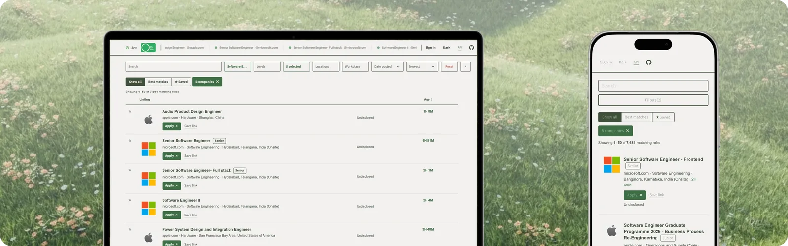

#  OpenTechJobs

Open-source tech job board. Scrapes job listings directly from ATS APIs, tracks them over time, and serves them through a lightweight public API.



## Architecture

To stay within a near-zero AWS budget, the system runs on an S3-hosted SQLite database (`jobs-read.db`) instead of an always-on RDS instance.

The pipeline uses two EventBridge Lambdas running on 5-minute schedules. Polling and writing are decoupled because polling is cheap, whereas persisting updates directly used to require a 48MB pull-modify-push per partition.

```
[EventBridge]
  │
  ├── (5 min) ──► scrape_handler.py ─────────────► S3: deltas/*.json
  │                                                   │
  ├── (5 min) ──► scrape_maintenance_handler.py ◄─────┘
  │                    │
  │                    ├──► S3: jobs-read.db
  │                    ├──► S3: bootstrap.json
  │                    └──► Evaluate Email Alerts
  │
  └── (30 min) ─► scrape_workday_handler.py ────► S3: deltas/*.json
```

### Components

**`scrape_handler.py` (Every 5 min):** Runs `probe.py` against the boards that are due this tick, using `If-None-Match` HTTP headers. Around 94% of polls return `304 Not Modified` with no payload (Greenhouse, Lever, Ashby, SmartRecruiters). Writes small delta files (`deltas/{ts}-{run}.json`) for companies with changed listings. Never touches the database directly.

Which boards are due is decided by observed activity, not by position in a list (`loader/scrape_state.py`). A board that just posted is polled again in five minutes, the tick's own floor. One that answers "nothing changed" backs off gradually -- 5, 8, 11, 17, 25, 38, 57, 85, 128, 192 minutes -- to a four-hour ceiling, and drops straight back to five minutes the moment it posts again. A board that errors holds its interval rather than backing off, because failing is not the same as quiet.

**`scrape_maintenance_handler.py` (Every 5 min):** Replays pending delta fragments into `jobs-read.db` incrementally, uploads the updated database to S3, and deletes fragments only after a successful push. Evaluates saved-filter alerts and rebuilds `bootstrap.json`.

**`scrape_workday_handler.py` (Hourly):** Polls the boards that are too big or too slow for the five-minute sweep: the Workday tenants pinned in `companies.yml`, the companies that run their own careers software (Amazon, Microsoft, Google, Apple, Check Point), and the platforms reached through a pin (Oracle Recruiting Cloud, Eightfold, WP Job Openings). Each pin can ask for a slower cadence with `every_hours`.

**`api/handler.py` (Behind Cloudflare → CloudFront → API Gateway):** Reads `jobs-read.db` from `/tmp`, refreshed via lightweight HEAD checks.

**Discovery Workflow (Daily via GitHub Actions):** Queries the Common Crawl URL index → Verifies endpoints → Outputs `domains.txt` → Resolves company names.

### Storage Optimizations

The snapshot stays small enough to download into a Lambda's `/tmp` on every refresh:

- Job descriptions are stored as individual S3 objects and fetched on-demand.
- Raw JSON payloads were removed entirely.
- Search runs on a contentless SQLite FTS5 index.

Counts and file size move every few minutes, so they are not written down here: `/api/health` reports the live totals, the snapshot's version and how old the copy being served is, and `/api/stats` reports the rest.

### Freshness

Two different ages, and they are worth keeping apart. A listing's **age** is how long ago the employer posted it, which is what the board sorts by. A board's **refresh age** is how long ago this project last asked that employer for its listings.

A new job reaches the live site within about five minutes of the next poll of the board carrying it, and how soon that comes depends on how active the board is: five minutes for one posting regularly, up to four hours for one that has been quiet through ten straight polls. The merge then publishes within five minutes, and the API serves the new snapshot within a minute of that.

Not every board is polled every five minutes, and the claim that they were was wrong when this said so: measured over 288 runs in September 2026, around 7,500 boards were due each tick against a cap of 600, which is a queue rather than a rotation.

Some employers cannot be read at all. IBM's Avature board answers every listing URL, its sitemap included, with an empty response; Amdocs and Qualcomm's Eightfold tenants refuse anonymous requests. Those companies are recorded as unresolved rather than attached to a guessed board.

## Authentication

All job board search and API endpoints require no authentication.

The optional Alerts feature (saving filters and receiving email digests) uses AWS Cognito:

- **Google OAuth**
- **GitHub OAuth:** Custom Lambda authorization flow (required because GitHub lacks an OIDC discovery endpoint).
- **Email One-Time Password (OTP):** Custom Lambda authentication flow for passwordless sign-in.

## Repository Structure

| Path / File | Purpose |
|---|---|
| `probe.py` | ATS discovery and scraping engine using conditional requests. Includes `--selftest`, `--verbose`, and `--raw` CLI flags for debugging. |
| `companies.yml` | Explicit Comeet and Workday configuration pins. |
| `domains.txt` | List of resolved company domains. |
| `db/schema.sql` | Database schema, including the contentless FTS5 virtual table. |
| `loader/load_to_sqlite.py` | Converts `resolved.json` into `jobs-read.db` with an optional S3 upload. |
| `loader/deltas.py` | Delta fragment store utilities (write, list, read, delete). |
| `loader/descriptions.py` | Manages description blobs in S3. Hash-gated to prevent duplicate PUT operations. |
| `loader/bootstrap.py` | Generates `bootstrap.json` for frontend prerendering. |
| `api/` | API Lambda implementation. See `api/README.md`. |
| `alerts.py` | Evaluates saved filters and sends notification emails. |
| `scrape_maintenance_handler.py` | 5-minute pipeline applier: merges delta fragments into `jobs-read.db`. |
| `scrape_workday_handler.py` | 30-minute Workday scraper handler. |
| `dispatch_workflow_handler.py` | Triggers GitHub workflows that bypass GitHub Cron schedules. |
| `resolve_company_names.py` | Maps internal board tokens to real company names. |
| `github_auth_handler.py` | Custom Cognito authentication Lambda for GitHub OAuth and Email OTP. |
| `frontend/` | Static frontend (`index.html`, `style.css`, `app.js`). Calls `/api/*`. |
| `scripts/dev_server.py` | Local development server. |
| `infra/` | Terraform configuration. `infra/bootstrap/` provisions the initial state bucket. |
| `.github/workflows/` | CI/CD pipelines (discovery, `deploy-infra.yml`, `deploy-api.yml`, `deploy-frontend.yml`). |
