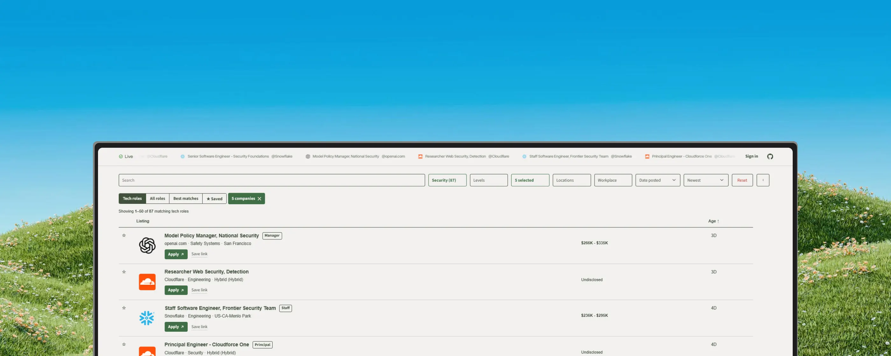

#  OpenTechJobs

Open-source tech job board. Scrapes job listings directly from ATS APIs and company career portals, tracks them over time, and serves them through a lightweight public API.

**Live site:** [opentechjobs.org](https://opentechjobs.org/) (board at [/board](https://opentechjobs.org/board), API docs at [/api/help](https://opentechjobs.org/api/help))

**License:** MIT



## Architecture

The database is SQLite on one small EC2 box (t4g.medium, il-central-1),
replicated continuously to S3 by Litestream. It used to be a snapshot in
S3 that every Lambda downloaded into `/tmp`; that stopped scaling when
the file passed 3GB, and the box replaced it in September 2026.

`ARCHITECTURE.md` is the authority on all of this, including the failure
modes and what is worth fixing next. What follows is the shape only.

```
  scrapers                   box (EC2 t4g.medium)              readers
  ────────                   ────────────────────              ───────

  GitHub Actions ─┐
  daily, slow     │          ┌──────────────────────────┐
  guesses ATS     ├─ S3 ────►│ fetch_fragments.py (30s) │
  tokens          │  delta   │ shadow_apply.py  (timer) │
                  │  frags   ├──────────────────────────┤
  EventBridge ────┘          │ jobs.db  ~3GB  WAL       │──► Litestream ──► S3
  Lambda, 5 min              ├──────────────────────────┤
  re-polls known             │ publish.py       (timer) │──► artifacts ──► S3
  company/ATS pairs          ├──────────────────────────┤
  browser ──► Cloudflare ───►│ gunicorn -w 2 --threads 4│
              Worker         │   api/handler.py (WSGI)  │
                             └──────────────────────────┘
```

Polling still runs on Lambda, because polling is cheap and mostly
answers `304`. Applying runs on the box, because it is the part that
needs the whole database.

### Components

**`scrape_handler.py` (Lambda, every 5 min).** Runs `probe.py` against
boards due on the current tick using `If-None-Match`. About 94% of polls
return `304 Not Modified` with no payload (Greenhouse, Lever, Ashby,
SmartRecruiters). Writes delta fragments to S3 and never touches the
database.

Polling order is driven by observed activity (`loader/scrape_state.py`).
A board that recently posted is polled every 5 minutes. Quiet boards
back off gradually (5, 8, 11, 17, 25, 38, 57, 85, 128, 192 minutes) up to
a 4-hour ceiling, resetting to 5 minutes the moment they post. Errors
hold their interval rather than backing off.

**`scrape_workday_handler.py` (Lambda, hourly).** The large or slow
targets: Workday tenants pinned in `companies.yml`, custom portals
(Amazon, Microsoft, Google, Apple, Check Point), and pinned platforms
(Oracle Recruiting Cloud, Eightfold, WP Job Openings). Pins can set their
own cadence with `every_hours`.

**`box/fetch_fragments.py` (timer, 30s)** copies new fragments to a local
spool, and **`box/shadow_apply.py` (timer)** applies them from there at
48MB a pass. The two are split because the Lambda deletes a fragment
within five minutes and an apply takes longer than that, so fragments
were being deleted before the box had seen them. Everything heavy takes
the same `flock` (`box/lock.py`), so an apply, a publish and a snapshot
never walk the database at once.

**`api/handler.py`** runs under gunicorn on the box (`-w 2 --threads 4`)
and reads `jobs.db` directly. A Cloudflare Worker
(`infra/cloudflare-worker.js`) routes to it:

```
/api/auth/*                 ──► CloudFront ──► Lambda      sign-in only
/api/*, /job/*, /company/*  ──► cloudflared ──► box:8000   everything else
everything else             ──► CloudFront ──► S3          static frontend
```

Sign-in stays on the Lambda because Worker route patterns cannot express
"except", so `/api/auth/*` is excluded in code. The Lambda stack is still
deployed and still receiving code, so deleting the three Worker routes is
a working rollback.

**Discovery (daily, GitHub Actions).** Queries the Common Crawl URL index,
verifies endpoints, writes `domains.txt`, resolves company names.

## Storage and freshness

Descriptions live as individual S3 objects and are fetched on demand, raw
JSON payloads are discarded, and search runs on a contentless SQLite FTS5
index. The FTS shadow tables are the largest single thing in the file, at
roughly 1.8GB of the 3GB.

Live counts, file sizes and snapshot versions are reported by
`/api/health` and `/api/stats`.

**Listing age vs. refresh age.** Listing age is when the employer posted
the role. Refresh age is when the pipeline last polled that employer.

**Propagation delay.** A new job reaches the site within about five
minutes of being polled: active boards are polled every 5 minutes, quiet
ones take up to 4 hours, and the box applies within a minute or two of a
fragment landing.

**Unreachable employers.** Employers that block anonymous access or
return empty responses (IBM Avature, Amdocs and Qualcomm on Eightfold)
are recorded as unresolved rather than mapped to a guessed endpoint.

## Authentication

All job board search and API endpoints require no authentication.

The optional Alerts feature (saving filters and receiving email digests) uses AWS Cognito:

- **Google OAuth**
- **GitHub OAuth:** custom Lambda authorization flow (required because GitHub lacks an OIDC discovery endpoint).
- **Email one-time password (OTP):** custom Lambda authentication flow for passwordless sign-in.

## Repository structure

| Path / file | Purpose |
|---|---|
| `probe.py` | ATS discovery and scraping engine using conditional requests. Includes `--selftest`, `--verbose`, and `--raw` CLI flags for debugging. |
| `companies.yml` | Explicit Comeet, Workday, and custom portal pins. |
| `domains.txt` | List of resolved company domains. |
| `db/schema.sql` | Database schema, including the contentless FTS5 virtual table. |
| `loader/load_to_sqlite.py` | Upserts `resolved.json` into `jobs.db`. Not a wipe-and-reload. |
| `loader/deltas.py` | Delta fragment store utilities (write, list, read, delete). |
| `loader/descriptions.py` | Manages description blobs in S3. Hash-gated to prevent duplicate PUT operations. |
| `loader/bootstrap.py` | Generates `bootstrap.json` for frontend prerendering. |
| `api/` | API Lambda implementation. See `api/README.md`. |
| `alerts.py` | Evaluates saved filters and sends notification emails. |
| `box/` | What runs on the box: the fragment fetcher, the applier, the publishers, the shared lock, and `CUTOVER.md`. |
| `ARCHITECTURE.md` | The current system in full, including failure modes. The authority. |
| `scrape_maintenance_handler.py` | The old Lambda applier. Kept deployed as the rollback path; not in the live pipeline. |
| `scrape_workday_handler.py` | Hourly Workday and custom portal scraper. |
| `dispatch_workflow_handler.py` | Triggers GitHub workflows that bypass GitHub Cron schedules. |
| `resolve_company_names.py` | Maps internal board tokens to real company names. |
| `github_auth_handler.py` | Custom Cognito authentication Lambda for GitHub OAuth and Email OTP. |
| `frontend/` | Static frontend, no framework and no build step: `index.html`, `board.html`, `account.html`, `contact.html`, one `style.css`, and `app.js` with `auth.js`, `account.js` and `cv_skills.js` beside it. Calls `/api/*`. |
| `scripts/dev_server.py` | Local development server. |
| `infra/` | Terraform configuration. `infra/bootstrap/` provisions the initial state bucket. |
| `.github/workflows/` | CI/CD pipelines (discovery, `deploy-infra.yml`, `deploy-api.yml`, `deploy-frontend.yml`). |
